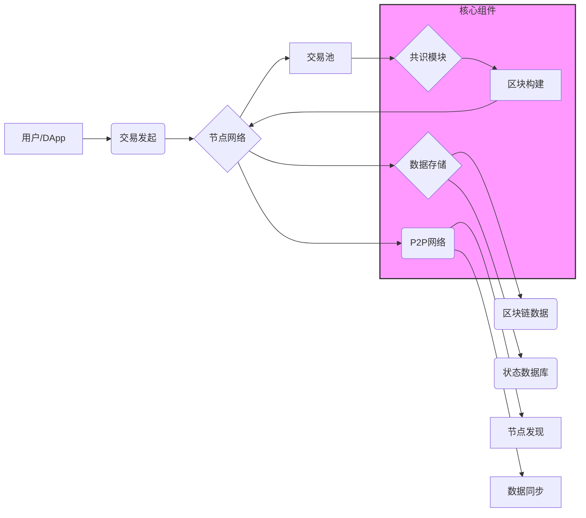
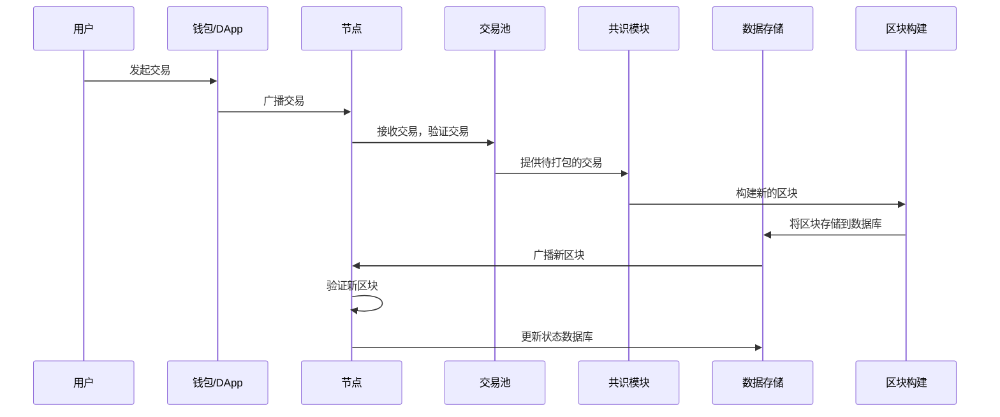

好的，作为一名 Golang 程序员，我将详细阐述 TitanChain 的区块链基础架构设计，包括系统架构、数据结构和核心组件。

### 1. 系统架构图



架构说明：

*   用户/DApp： 通过客户端发起交易。
*   交易发起： 用户通过钱包或 DApp 客户端创建并签名交易。
*   节点网络： 由多个 TitanChain 节点组成的 P2P 网络。
*   交易池： 存储待处理的交易。
*   共识模块： 负责对区块进行验证和排序，采用改进的 DPoS 共识机制。
*   区块构建： 将交易打包成区块。
*   数据存储： 将区块数据和状态数据存储到数据库中。
*   区块链数据： 存储完整的区块数据。
*   状态数据库： 存储当前区块链的状态，例如账户余额、智能合约状态等。
*   P2P 网络： 用于节点之间的通信。
*   节点发现： 用于发现网络中的其他节点。
*   数据同步： 用于同步区块链数据。

### 2. 核心数据结构定义 (Golang)

```go
package core

import (
	"crypto/ecdsa"
	"crypto/sha256"
	"encoding/binary"
	"time"

	"github.com/btcsuite/btcutil/base58"
)

// BlockHeader 定义区块头
type BlockHeader struct {
	Version    uint32    // 版本号
	PrevHash   []byte    // 前一个区块的哈希值
	MerkleRoot []byte    // Merkle 树根哈希
	Timestamp  int64     // 时间戳 (Unix 时间)
	Difficulty uint32    // 难度目标
	Nonce      uint32    // Nonce 值，用于 PoW (虽然 TitanChain 使用 DPoS，但可以保留用于未来扩展)
}

// Block 定义区块结构
type Block struct {
	Header       BlockHeader // 区块头
	Transactions []Transaction // 交易列表
}

// Transaction 定义交易结构
type Transaction struct {
	ID        []byte  // 交易ID (哈希)
	Timestamp int64   // 交易时间戳
	Input     []TxInput  // 交易输入
	Outputs   []TxOutput // 交易输出
}

// TxInput 定义交易输入
type TxInput struct {
	TxID      []byte    // 引用 UTXO 的交易 ID
	Vout      int       // 引用 UTXO 的输出索引
	Signature []byte    // 签名
	PubKey    []byte    // 公钥
}

// TxOutput 定义交易输出
type TxOutput struct {
	Value  int64  // 金额
	PubKeyHash []byte //锁定脚本 (锁定接收者的公钥哈希)
}

// 辅助函数：生成交易ID (哈希)
func (tx *Transaction) GenerateID() {
    data := []byte(string(tx.Timestamp))
    for _, input := range tx.Input {
        data = append(data, input.TxID...)
        data = append(data, []byte(string(input.Vout))...)
        data = append(data, input.Signature...)
        data = append(data, input.PubKey...)
    }
    for _, output := range tx.Outputs {
        data = append(data, []byte(string(output.Value))...)
		data = append(data,output.PubKeyHash...)
    }

    hash := sha256.Sum256(data)
    tx.ID = hash[:]
}

// 辅助函数：创建新的区块
func NewBlock(transactions []Transaction, prevHash []byte, difficulty uint32) *Block {
	header := BlockHeader{
		Version:    1,
		PrevHash:   prevHash,
		MerkleRoot: calculateMerkleRoot(transactions),
		Timestamp:  time.Now().Unix(),
		Difficulty: difficulty,
		Nonce:      0, // 在 DPoS 中可以忽略
	}
	return &Block{
		Header:       header,
		Transactions: transactions,
	}
}

// 辅助函数：计算 Merkle 树根哈希
func calculateMerkleRoot(transactions []Transaction) []byte {
	// TODO: 实现 Merkle 树计算逻辑
	// 这里只是一个占位符，需要实现真正的 Merkle 树算法
	if len(transactions) == 0 {
		return []byte{}
	}

	var hashes [][]byte
	for _, tx := range transactions {
		hashes = append(hashes, tx.ID) // 使用交易 ID 作为叶子节点
	}
	// TODO：使用哈希列表构建 Merkle 树并返回根哈希
	return hashes[0]
}

// 辅助函数：设置交易输出的锁定脚本 (P2PKH)
func (out *TxOutput) Lock(address string) {
    pubKeyHash := base58Decode(address)
    pubKeyHash = pubKeyHash[1 : len(pubKeyHash)-4]
    out.PubKeyHash = pubKeyHash
}

// 辅助函数：检查交易输入是否解锁输出
func (in *TxInput) UsesKey(pubKeyHash []byte) bool {
    lockingHash := hashPubKey(in.PubKey)
    return bytes.Compare(lockingHash, pubKeyHash) == 0
}

// 辅助函数：从地址解码公钥哈希
func base58Decode(address string) []byte {
    decoded, err := base58.Decode(address)
    if err != nil {
        log.Panic(err)
    }
    return decoded
}

// 辅助函数：哈希公钥
func hashPubKey(pubKey []byte) []byte {
    publicSHA256 := sha256.Sum256(pubKey)

    RIPEMD160Hasher := ripemd160.New()
    _, err := RIPEMD160Hasher.Write(publicSHA256[:])
    if err != nil {
        log.Panic(err)
    }
    publicRIPEMD160 := RIPEMD160Hasher.Sum(nil)

    return publicRIPEMD160
}
```

数据结构说明：

*   BlockHeader： 包含区块的元数据，例如版本号、前一个区块的哈希值、Merkle 树根哈希、时间戳、难度目标和 Nonce 值。
*   Block： 包含区块头和交易列表。
*   Transaction： 包含交易的输入和输出。
*   TxInput： 引用之前交易的输出，包含 UTXO 的交易 ID、输出索引、签名和公钥。
*   TxOutput： 定义交易的输出，包含金额和锁定脚本（锁定接收者的公钥哈希）。

编码方式：

*   使用 `encoding/binary` 包进行基本数据类型的编码和解码。
*   使用 `encoding/json` 包进行结构体的序列化和反序列化。
*   对于哈希值，使用 `[]byte` 类型存储。

### 3. 组件交互流程图



流程说明：

1.  用户发起交易： 用户通过钱包或 DApp 客户端创建并签名交易。
2.  广播交易： 钱包或 DApp 客户端将交易广播到节点网络。
3.  接收交易： 节点接收到交易后，首先验证交易的有效性，例如签名是否正确、余额是否充足等。
4.  存储交易： 验证通过的交易被存储到交易池中，等待打包到区块中。
5.  提供交易： 共识模块从交易池中选择待打包的交易。
6.  构建区块： 共识模块按照一定的规则构建新的区块，包括选择交易、计算 Merkle 树根哈希、设置时间戳等。
7.  存储区块： 新的区块被存储到数据库中，包括区块数据和状态数据。
8.  广播区块： 节点将新的区块广播到网络中的其他节点。
9.  验证区块： 其他节点接收到新的区块后，首先验证区块的有效性，例如区块头哈希是否正确、交易是否有效等。
10. 更新状态： 验证通过的区块被添加到区块链中，节点更新本地的状态数据库，例如账户余额、智能合约状态等。

### 4. 区块结构设计

4.1 区块头字段：

```go
type BlockHeader struct {
	Version    uint32    // 版本号
	PrevHash   []byte    // 前一个区块的哈希值
	MerkleRoot []byte    // Merkle 树根哈希
	Timestamp  int64     // 时间戳 (Unix 时间)
	Difficulty uint32    // 难度目标 (DPoS 中可以忽略，但保留)
	Nonce      uint32    // Nonce 值，用于 PoW (虽然 TitanChain 使用 DPoS，但可以保留用于未来扩展)
	Validator  []byte    // 提议区块的验证者公钥
	Signature  []byte    // 验证者对区块头的签名
}
```

字段说明：

*   Version： 区块版本号，用于标识区块结构的版本。
*   PrevHash： 前一个区块的哈希值，用于连接区块链。
*   MerkleRoot： Merkle 树根哈希，用于验证区块中交易的完整性。
*   Timestamp： 时间戳，表示区块创建的时间。
*   Difficulty： 难度目标，用于调整区块生成的难度 (在 DPoS 中可以忽略，但可以保留用于未来扩展)。
*   Nonce： Nonce 值，用于 PoW 算法 (在 DPoS 中可以忽略，但可以保留用于未来扩展)。
*   Validator： 提议区块的验证者公钥。
*   Signature： 验证者对区块头的签名。

4.2 交易数据结构和编码方式：

交易数据结构如上文定义，编码方式使用 `encoding/binary` 和 `encoding/json` 包。

4.3 区块大小限制和扩展性策略：

*   区块大小限制： 初始区块大小限制为 2MB。
*   扩展性策略：
    *   动态调整区块大小： 根据网络拥堵情况，动态调整区块大小。
    *   分片技术： 采用状态分片技术，将区块链状态分割成多个分片，并行处理交易，提高 TPS。
    *   Layer 2 解决方案： 支持 Layer 2 解决方案，例如状态通道、Plasma 等，将部分交易转移到链下处理，减轻主链的负担。

### 5. 节点网络架构

5.1 P2P 网络协议选择：

选择 libp2p 作为 P2P 网络协议。

选择理由：

*   模块化： libp2p 提供了模块化的网络堆栈，可以方便地构建灵活的网络拓扑。
*   可扩展性： libp2p 支持多种传输协议和发现协议，可以方便地扩展网络功能。
*   安全性： libp2p 提供了加密和认证功能，可以保证节点之间的通信安全。

5.2 节点发现机制设计：

*   DHT (Distributed Hash Table)： 使用 DHT 协议进行节点发现，例如 Kademlia 算法。
*   引导节点： 预先配置一些引导节点，新节点可以通过连接引导节点来发现网络中的其他节点。
*   多播 DNS (mDNS)： 在局域网内使用 mDNS 协议进行节点发现。

5.3 数据同步与广播机制：

*   Gossip 协议： 使用 Gossip 协议进行数据广播，提高广播效率和可靠性。
*   区块同步： 新节点加入网络时，需要从其他节点同步区块链数据。可以使用以下方法进行区块同步：
    *   全节点同步： 下载完整的区块链数据。
    *   轻节点同步： 只下载区块头，验证交易时从其他节点请求 Merkle 证明。
*   交易同步： 节点之间同步交易池中的交易。

### 6. 数据存储

6.1 选择适合的数据库：

选择 LevelDB 或 BadgerDB 作为数据库。

选择理由：

*   LevelDB：
    *   高性能：LevelDB 是一种快速的键值存储数据库，适合存储区块链数据。
    *   简单易用：LevelDB API 简单易用，容易上手。
*   BadgerDB：
    *   Golang 实现：BadgerDB 是一个用 Golang 实现的键值存储数据库，与 TitanChain 的开发语言一致。
    *   高性能：BadgerDB 性能优异，支持 ACID 事务。

6.2 设计链上数据与状态存储结构：

*   区块链数据：
    *   存储完整的区块数据，包括区块头和交易列表。
    *   使用键值对存储，Key 为区块哈希，Value 为区块数据。
*   状态数据库：
    *   存储当前区块链的状态，例如账户余额、智能合约状态等。
    *   使用 Merkle Patricia Tree (MPT) 作为数据结构，高效地存储和验证状态数据。
    *   使用键值对存储，Key 为账户地址或智能合约地址，Value 为账户余额或智能合约状态。

### 总结

以上是 TitanChain 的区块链基础架构设计，包括系统架构、数据结构和核心组件。通过 Golang 语言的特性，可以更好地实现公链的高性能和安全性，同时结合 WASM 虚拟机，可以降低开发者的学习成本，吸引更多开发者加入 TitanChain 生态。
