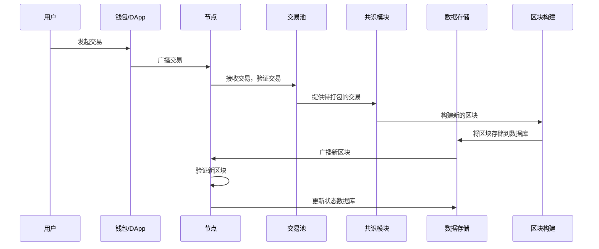

好的，作为一名 Golang 程序员，我将详细设计 TitanChain 的交易处理流程，包括交易结构设计、交易池管理和交易执行。

### 1. 交易结构设计

1.1 交易格式与序列化方案

交易格式：

```go
package core

import (
	"crypto/ecdsa"
	"crypto/sha256"
	"encoding/binary"
	"encoding/json"
	"time"

	"github.com/btcsuite/btcutil/base58"
)

// Transaction 定义交易结构
type Transaction struct {
	ID        []byte  // 交易ID (哈希)
	Timestamp int64   // 交易时间戳
	Input     []TxInput  // 交易输入
	Outputs   []TxOutput // 交易输出
	Fee       int64     // 交易手续费
	Signature []byte  // 交易签名
}

// TxInput 定义交易输入
type TxInput struct {
	TxID      []byte    // 引用 UTXO 的交易 ID
	Vout      int       // 引用 UTXO 的输出索引
	Signature []byte    // 签名
	PubKey    []byte    // 公钥
}

// TxOutput 定义交易输出
type TxOutput struct {
	Value  int64  // 金额
	PubKeyHash []byte //锁定脚本 (锁定接收者的公钥哈希)
}

// 辅助函数：生成交易ID (哈希)
func (tx *Transaction) GenerateID() {
    data := []byte(string(tx.Timestamp))
    for _, input := range tx.Input {
        data = append(data, input.TxID...)
        data = append(data, []byte(string(input.Vout))...)
        data = append(data, input.Signature...)
        data = append(data, input.PubKey...)
    }
    for _, output := range tx.Outputs {
        data = append(data, []byte(string(output.Value))...)
		data = append(data,output.PubKeyHash...)
    }
    data = append(data, []byte(string(tx.Fee))...)
    hash := sha256.Sum256(data)
    tx.ID = hash[:]
}

// 辅助函数：设置交易输出的锁定脚本 (P2PKH)
func (out *TxOutput) Lock(address string) {
    pubKeyHash := base58Decode(address)
    pubKeyHash = pubKeyHash[1 : len(pubKeyHash)-4]
    out.PubKeyHash = pubKeyHash
}

// 辅助函数：从地址解码公钥哈希
func base58Decode(address string) []byte {
    decoded, err := base58.Decode(address)
    if err != nil {
        log.Panic(err)
    }
    return decoded
}

// 辅助函数：哈希公钥
func hashPubKey(pubKey []byte) []byte {
    publicSHA256 := sha256.Sum256(pubKey)

    RIPEMD160Hasher := ripemd160.New()
    _, err := RIPEMD160Hasher.Write(publicSHA256[:])
    if err != nil {
        log.Panic(err)
    }
    publicRIPEMD160 := RIPEMD160Hasher.Sum(nil)

    return publicRIPEMD160
}

// Serialize 序列化交易
func (tx *Transaction) Serialize() ([]byte, error) {
	return json.Marshal(tx)
}

// Deserialize 反序列化交易
func DeserializeTransaction(data []byte) (*Transaction, error) {
	var tx Transaction
	err := json.Unmarshal(data, &tx)
	if err != nil {
		return nil, err
	}
	return &tx, nil
}

```

字段说明：

*   ID： 交易 ID，通过对交易内容的哈希生成。
*   Timestamp： 交易创建的时间戳。
*   Input： 交易输入，引用之前交易的 UTXO。
*   Outputs： 交易输出，定义交易的接收者和金额。
*   Fee： 交易手续费，用于激励矿工打包交易。
*   Signature: 交易签名，用于验证交易的合法性

序列化方案：

*   使用 `encoding/json` 包进行结构体的序列化和反序列化。
*   优点：简单易用，可读性强。
*   缺点：性能相对较低，数据量较大。
*   可以考虑使用 `protobuf` 或 `msgpack` 等更高效的序列化方案。

1.2 签名验证流程

签名算法：

*   选择 Ed25519 签名算法。
*   优点：安全性高，性能好，签名长度小。

签名流程：

1.  交易创建者 使用私钥对交易内容进行签名。
2.  节点 接收到交易后，使用交易创建者的公钥验证签名是否有效。
3.  只有签名验证通过的交易才会被加入交易池。

Golang 代码示例：

```go
package core

import (
	"crypto/ed25519"
	"crypto/sha256"
	"fmt"
)

// SignTransaction 对交易进行签名
func (tx *Transaction) Sign(privateKey ed25519.PrivateKey) error {
	// 1. 将交易内容进行哈希
	data := tx.DataToSign()
	hash := sha256.Sum256(data)

	// 2. 使用私钥对哈希值进行签名
	signature := ed25519.Sign(privateKey, hash[:])
	tx.Signature = signature

	return nil
}

// VerifySignature 验证交易签名
func (tx *Transaction) VerifySignature(publicKey ed25519.PublicKey) bool {
	// 1. 将交易内容进行哈希
	data := tx.DataToSign()
	hash := sha256.Sum256(data)

	// 2. 使用公钥验证签名是否有效
	return ed25519.Verify(publicKey, hash[:], tx.Signature)
}

// DataToSign 获取需要签名的数据
func (tx *Transaction) DataToSign() []byte {
	data := []byte(string(tx.Timestamp))
    for _, input := range tx.Input {
        data = append(data, input.TxID...)
        data = append(data, []byte(string(input.Vout))...)
        data = append(data, input.PubKey...)
    }
    for _, output := range tx.Outputs {
        data = append(data, []byte(string(output.Value))...)
		data = append(data,output.PubKeyHash...)
    }
    data = append(data, []byte(string(tx.Fee))...)
	return data
}
```

1.3 手续费机制

手续费计算方式：

*   动态手续费： 根据网络拥堵情况动态调整手续费。
*   Gas Limit： 定义交易执行的最大计算量。
*   Gas Price： 用户愿意为每个 Gas 支付的价格。
*   手续费 = Gas Limit \* Gas Price

手续费分配：

*   手续费分配给打包交易的验证者，作为奖励。

Golang 代码示例：

```go
package core

// CalculateFee 计算手续费
func CalculateFee(gasLimit uint64, gasPrice uint64) uint64 {
	return gasLimit * gasPrice
}

// GetMinFee 获取最小手续费
func GetMinFee() uint64 {
    //根据当前网络拥堵程度返回最小手续费
    return 100
}
```

### 2. 交易池管理

2.1 内存池设计

数据结构：

*   使用 map 存储交易，Key 为交易 ID，Value 为交易对象。
*   使用 优先级队列 存储交易，按照手续费、时间戳等排序。

Golang 代码示例：

```go
package mempool

import (
	"container/heap"
	"sync"
	"titan/core"
)

// MemPool 内存池
type MemPool struct {
	transactions map[string]*core.Transaction // 存储交易
	priorityQueue PriorityQueue              // 优先级队列
	lock         sync.RWMutex                 // 读写锁
	capacity     int                          // 内存池容量
}

// NewMemPool 创建一个新的内存池
func NewMemPool(capacity int) *MemPool {
	return &MemPool{
		transactions:  make(map[string]*core.Transaction),
		priorityQueue: make(PriorityQueue, 0, capacity),
		lock:          sync.RWMutex{},
		capacity:      capacity,
	}
}

// AddTransaction 添加交易到内存池
func (mp *MemPool) AddTransaction(tx *core.Transaction) error {
	mp.lock.Lock()
	defer mp.lock.Unlock()

	// 1. 验证交易
	err := mp.validateTransaction(tx)
	if err != nil {
		return err
	}

	// 2. 检查内存池是否已满
	if len(mp.transactions) >= mp.capacity {
		return fmt.Errorf("内存池已满")
	}

	// 3. 添加交易到 map
	mp.transactions[string(tx.ID)] = tx

	// 4. 添加交易到优先级队列
	heap.Push(&mp.priorityQueue, &Item{
		transaction: tx,
		priority:    tx.Fee, // 按照手续费排序
	})

	return nil
}

// GetTransactions 获取内存池中的交易
func (mp *MemPool) GetTransactions() []*core.Transaction {
	mp.lock.RLock()
	defer mp.lock.RUnlock()

	txs := make([]*core.Transaction, 0, len(mp.transactions))
	for _, tx := range mp.transactions {
		txs = append(txs, tx)
	}
	return txs
}

// GetBestTransactions 获取优先级最高的 N 个交易
func (mp *MemPool) GetBestTransactions(n int) []*core.Transaction {
	mp.lock.RLock()
	defer mp.lock.RUnlock()

	txs := make([]*core.Transaction, 0, n)
	length := len(mp.priorityQueue)
	if length < n {
		n = length
	}

	tempQueue := make(PriorityQueue, length)
	copy(tempQueue, mp.priorityQueue)
	heap.Init(&tempQueue)

	for i := 0; i < n; i++ {
		item := heap.Pop(&tempQueue).(*Item)
		txs = append(txs, item.transaction)
	}

	return txs
}

// RemoveTransaction 从内存池中移除交易
func (mp *MemPool) RemoveTransaction(txID []byte) {
	mp.lock.Lock()
	defer mp.lock.Unlock()

	delete(mp.transactions, string(txID))

	// 从优先级队列中移除交易 (需要遍历队列)
	for i, item := range mp.priorityQueue {
		if string(item.transaction.ID) == string(txID) {
			heap.Remove(&mp.priorityQueue, i)
			break
		}
	}
}

// validateTransaction 验证交易
func (mp *MemPool) validateTransaction(tx *core.Transaction) error {
	// TODO: 验证交易的有效性
	return nil
}

// Item 定义优先级队列中的元素
type Item struct {
	transaction *core.Transaction // 交易
	priority    int64              // 优先级 (手续费)
	index       int                // 元素在队列中的索引
}

// PriorityQueue 定义优先级队列
type PriorityQueue []*Item

func (pq PriorityQueue) Len() int { return len(pq) }

func (pq PriorityQueue) Less(i, j int) bool {
	// 按照优先级 (手续费) 排序
	return pq[i].priority > pq[j].priority
}

func (pq PriorityQueue) Swap(i, j int) {
	pq[i], pq[j] = pq[j], pq[i]
	pq[i].index = i
	pq[j].index = j
}

func (pq *PriorityQueue) Push(x interface{}) {
	n := len(*pq)
	item := x.(*Item)
	item.index = n
	*pq = append(*pq, item)
}

func (pq *PriorityQueue) Pop() interface{} {
	old := *pq
	n := len(old)
	item := old[n-1]
	old[n-1] = nil  // avoid memory leak
	item.index = -1 // for safety
	*pq = old[0 : n-1]
	return item
}

// update modifies the priority and value of an Item in the queue.
func (pq *PriorityQueue) update(item *Item, transaction *core.Transaction, priority int64) {
	item.transaction = transaction
	item.priority = priority
	heap.Fix(pq, item.index)
}
```

2.2 交易排序与优先级策略

排序策略：

1.  手续费优先： 手续费越高的交易，优先级越高。
2.  时间戳优先： 同等手续费的交易，时间戳越早的交易，优先级越高。
3.  交易依赖： 优先打包被其他交易依赖的交易。

2.3 过期与替换规则

过期规则：

*   交易在内存池中存在时间超过一定时间，则被视为过期。
*   交易引用的 UTXO 已经被花费，则交易被视为过期。

替换规则：

*   当内存池已满时，新的交易可以替换掉手续费较低的交易。
*   新的交易可以替换掉与其冲突的交易。

### 3. 交易执行

3.1 状态转换函数

状态转换函数根据交易的输入和输出，更新区块链的状态。

状态转换流程：

1.  验证交易： 验证交易的签名、手续费等是否有效。
2.  检查 UTXO： 检查交易输入引用的 UTXO 是否存在且未被花费。
3.  更新 UTXO： 将交易输入引用的 UTXO 标记为已花费，并创建新的 UTXO。
4.  更新账户余额： 根据交易的输出，更新账户余额。

3.2 并行执行可能性评估

*   UTXO 模型天生支持并行执行。
*   账户余额模型需要解决状态冲突问题才能实现并行执行。
*   可以使用状态分片技术实现并行执行。

3.3 原子性与回滚机制

*   交易执行必须保证原子性，即要么全部成功，要么全部失败。
*   如果交易执行失败，需要回滚所有状态变更。
*   可以使用事务机制实现原子性和回滚。

### 4. 输出

4.1 交易流程图



4.2 交易数据结构定义

如 1.1 交易格式与序列化方案 中定义。

4.3 内存池管理算法

如 2.1 内存池设计 中定义。

### 总结

以上是 TitanChain 的交易处理流程详细设计，包括交易结构设计、交易池管理和交易执行。通过 Golang 语言的特性，可以更好地实现交易处理的高性能和安全性。