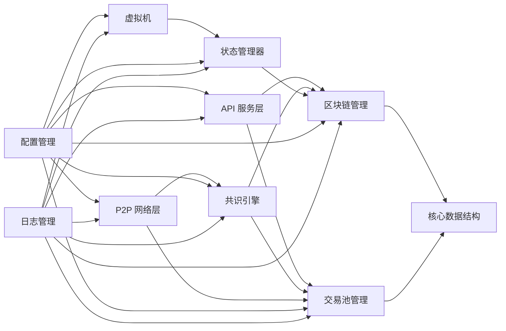

好的，作为一名 Golang 程序员，我将详细设计 TitanChain 的 Golang 实现策略，包括代码架构、核心模块规划和测试策略。

### 1. 代码架构设计

1.1 包结构与模块划分

为了保证代码的可维护性和可扩展性，TitanChain 的代码架构将采用分层设计，并按照功能划分为多个包。

```
titanchain/
├── core/          # 核心数据结构和算法
│   ├── block.go       # 区块结构定义和相关操作
│   ├── transaction.go # 交易结构定义和相关操作
│   ├── utxo.go        # UTXO 模型相关定义和操作
│   ├── types.go       # 常用类型定义
│   └── crypto.go      # 加密算法相关函数
├── blockchain/    # 区块链管理
│   ├── chain.go       # 区块链结构定义和相关操作
│   ├── database.go    # 数据库操作接口和实现
│   └── indexer.go     # 索引器，用于快速查询
├── mempool/       # 交易池管理
│   ├── mempool.go     # 内存池结构定义和相关操作
│   └── priority.go    # 优先级队列实现
├── p2p/           # P2P 网络层
│   ├── peer.go        # 节点管理
│   ├── server.go      # P2P 服务
│   ├── message.go     # 消息定义和处理
│   └── protocol.go    # P2P 协议
├── consensus/     # 共识引擎
│   ├── dpos.go        # DPoS 共识算法实现
│   ├── validator.go   # 验证者管理
│   └── vote.go        # 投票机制
├── vm/            # 虚拟机
│   ├── vm.go          # 虚拟机接口和实现
│   ├── context.go     # 执行上下文
│   └── gas.go         # Gas 计量
├── state/          # 状态管理
│   ├── state.go       # 状态数据库接口和实现
│   ├── trie.go        # Merkle Patricia Trie 实现
│   └── account.go     # 账户管理
├── api/           # API 服务层
│   ├── handler.go     # API 处理函数
│   ├── server.go      # API 服务
│   └── middleware.go  # 中间件
├── config/        # 配置管理
│   └── config.go      # 配置文件加载和管理
├── log/           # 日志管理
│   └── log.go         # 日志接口和实现
├── cmd/           # 命令行工具
│   └── titanchain/    # 主程序入口
│       └── main.go      # 主函数
└── scripts/       # 脚本
    └── deploy.sh    # 部署脚本
```

1.2 接口定义与依赖管理

*   使用接口定义模块之间的交互，降低模块之间的耦合度。
*   使用依赖注入的方式管理模块之间的依赖关系，提高代码的可测试性。
*   使用 `go mod` 进行依赖管理。

示例：数据库接口

```go
package blockchain

// Database 数据库接口
type Database interface {
	Put(key []byte, value []byte) error
	Get(key []byte) ([]byte, error)
	Delete(key []byte) error
	Close() error
}
```

1.3 并发模型设计

*   使用 `goroutine` 和 `channel` 实现并发。
*   使用 `sync.Mutex` 和 `sync.RWMutex` 实现锁机制。
*   使用 `errgroup.Group` 管理多个 `goroutine`。

示例：P2P 消息处理

```go
package p2p

import (
	"sync"

	"github.com/your-username/titanchain/core"
)

// Peer 节点
type Peer struct {
	conn net.Conn
	// ...
	send chan *core.Transaction
	wg   sync.WaitGroup
}

// Start 启动节点
func (p *Peer) Start() {
	p.wg.Add(2)
	go p.readLoop()
	go p.writeLoop()
	p.wg.Wait()
}

// readLoop 读消息循环
func (p *Peer) readLoop() {
	defer p.wg.Done()
	// ...
}

// writeLoop 写消息循环
func (p *Peer) writeLoop() {
	defer p.wg.Done()
	for tx := range p.send {
		// ...
	}
}

// SendTransaction 发送交易
func (p *Peer) SendTransaction(tx *core.Transaction) {
	p.send <- tx
}
```

### 2. 核心模块规划

2.1 区块处理引擎

*   功能： 负责区块的验证、添加和查询。
*   依赖： `core`、`blockchain`、`state`。
*   关键步骤：
    1.  验证区块的合法性，包括区块头的哈希值、时间戳、难度值等。
    2.  验证区块中所有交易的合法性。
    3.  将区块添加到区块链中。
    4.  更新状态数据库。
    5.  广播新区块。

2.2 P2P 网络层

*   功能： 负责节点之间的通信，包括消息的广播、节点的发现等。
*   依赖： `p2p`、`core`。
*   关键步骤：
    1.  节点启动时，连接到已知的种子节点。
    2.  节点之间交换节点信息，建立连接。
    3.  节点接收到新的交易或区块时，广播给其他节点。

2.3 共识引擎

*   功能： 负责生成新的区块，并保证区块链的一致性。
*   依赖： `consensus`、`core`、`blockchain`、`mempool`。
*   关键步骤：
    1.  验证者从交易池中选择交易，构建新的区块。
    2.  验证者对新的区块进行签名。
    3.  验证者将新的区块广播给其他节点。
    4.  其他节点验证区块的签名，并将区块添加到区块链中。

2.4 交易执行器

*   功能： 负责执行交易，并更新状态数据库。
*   依赖： `vm`、`state`、`core`。
*   关键步骤：
    1.  验证交易的合法性，包括签名、手续费等。
    2.  检查交易输入引用的 UTXO 是否存在且未被花费。
    3.  执行交易的智能合约。
    4.  更新状态数据库，包括 UTXO 和账户余额。

2.5 状态管理器

*   功能： 负责管理区块链的状态，包括 UTXO 和账户余额。
*   依赖： `state`、`core`、`blockchain`。
*   关键步骤：
    1.  使用 Merkle Patricia Trie 存储状态数据。
    2.  提供接口用于查询和更新状态数据。
    3.  保证状态数据的一致性和持久性。

2.6 API 服务层

*   功能： 负责提供 API 接口，供外部应用访问区块链数据。
*   依赖： `api`、`core`、`blockchain`、`mempool`。
*   关键步骤：
    1.  使用 `net/http` 或 `gin` 等框架搭建 API 服务。
    2.  提供 API 接口，用于查询区块、交易、账户余额等。
    3.  提供 API 接口，用于发送交易。

### 3. 测试策略

3.1 单元测试框架

*   使用 `go test` 作为单元测试框架。
*   编写单元测试用例，覆盖所有核心模块。
*   使用 `mock` 框架模拟依赖，隔离测试单元。

3.2 集成测试环境

*   搭建本地测试网络，模拟真实的区块链环境。
*   编写集成测试用例，测试模块之间的交互。
*   使用 `docker-compose` 部署测试网络。

3.3 性能测试方法

*   使用 `go test -bench` 进行性能测试。
*   使用 `pprof` 进行性能分析。
*   模拟高并发场景，测试系统的吞吐量和延迟。

### 4. 输出

4.1 详细代码架构文档

*   包括模块划分、接口定义、依赖关系、并发模型等。
*   使用 Markdown 格式编写。

4.2 模块依赖图



4.3 GitHub 仓库结构规划

```
titanchain/
├── core/
├── blockchain/
├── mempool/
├── p2p/
├── consensus/
├── vm/
├── state/
├── api/
├── config/
├── log/
├── cmd/
│   └── titanchain/
├── scripts/
├── docs/       # 文档
│   └── architecture.md
├── tests/      # 测试用例
│   ├── unit/
│   ├── integration/
│   └── performance/
├── .gitignore
├── go.mod
├── go.sum
└── LICENSE
```

希望以上设计能够帮助您更好地开发 TitanChain。