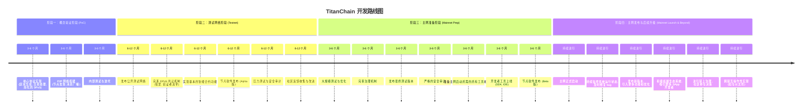

好的，作为一名 Golang 程序员，我将为你规划 TitanChain 的开发路线图与里程碑，并提供资源规划建议。

### TitanChain 开发路线图与里程碑

愿景： 打造一个高性能、可扩展、安全的区块链平台，支持丰富的 DApp 生态。

整体策略： 采用迭代式开发，从小规模 PoC 到主网发布，逐步完善功能并优化性能。注重社区参与和反馈，不断调整开发方向。

1. 阶段划分

*   阶段一：概念验证阶段 (PoC)
    *   目标： 验证核心技术可行性，搭建最小可用原型。
    *   周期： 3-6 个月
    *   关键特征：
        *   聚焦核心功能：区块生成、交易处理、共识机制 (DPoS 简化版)。
        *   代码质量高于一切：编写清晰、可维护的代码，为后续迭代打好基础。
        *   快速迭代：频繁发布原型版本，收集反馈并快速改进。
        *   内部测试：主要由开发团队进行测试。
*   阶段二：测试网络阶段 (Testnet)
    *   目标： 验证系统稳定性、性能和安全性，吸引早期开发者和用户参与。
    *   周期： 6-12 个月
    *   关键特征：
        *   发布公开测试网络，鼓励社区参与测试。
        *   完善共识机制，引入更复杂的 DPoS 实现。
        *   实现基本的智能合约功能。
        *   进行压力测试和安全审计。
        *   收集社区反馈，持续改进。
*   阶段三：主网准备阶段 (Mainnet Prep)
    *   目标： 为主网发布做好充分准备，确保系统的稳定性和安全性。
    *   周期： 3-6 个月
    *   关键特征：
        *   进行大规模测试和优化。
        *   完善治理机制。
        *   发布最终测试版本。
        *   进行严格的安全审计。
        *   准备主网启动所需的所有工具和文档。
*   阶段四：主网发布与后续升级 (Mainnet Launch & Beyond)
    *   目标： 正式发布主网，吸引用户和开发者，不断完善和升级系统。
    *   周期： 持续进行
    *   关键特征：
        *   主网正式启动。
        *   持续监控系统运行状态，及时修复 bug。
        *   发布新版本，引入更多功能和优化。
        *   积极拓展生态系统，吸引更多 DApp 开发者。
        *   进行链上治理，社区参与决策。

2. 关键里程碑

| 里程碑                                     | 阶段     | 描述                                                                                                                                                                 | 完成标准                                                                                                                                                                                |
| :----------------------------------------- | :------- | :------------------------------------------------------------------------------------------------------------------------------------------------------------------- | :-------------------------------------------------------------------------------------------------------------------------------------------------------------------------------------- |
| 核心协议实现                           | PoC      | 实现基本的区块生成、交易处理、共识机制 (简化版 DPoS)。                                                                                                                     | 区块链能够稳定运行，能够处理简单的交易，共识机制能够保证链的一致性。                                                                                                                        |
| P2P 网络搭建                             | PoC      | 搭建基本的 P2P 网络，实现节点之间的通信。                                                                                                                             | 节点能够互相发现，能够进行消息的广播和接收。                                                                                                                                                  |
| 基本智能合约功能                       | Testnet  | 实现基本的智能合约功能，支持简单的合约部署和执行。                                                                                                                       | 能够部署和执行简单的智能合约，例如 ERC-20 代币合约。                                                                                                                                           |
| DPoS 共识机制完善                      | Testnet  | 完善 DPoS 共识机制，引入更复杂的投票和验证者选举机制。                                                                                                                      | 共识机制能够有效防止恶意攻击，保证链的安全性和稳定性。                                                                                                                                               |
| 节点软件发布 (Alpha 版)               | Testnet  | 发布 Alpha 版节点软件，供早期开发者和用户测试。                                                                                                                          | 节点软件能够正常运行，提供基本的 API 接口。                                                                                                                                                    |
| 安全审计完成                             | Mainnet Prep | 完成安全审计，确保系统的安全性。                                                                                                                                     | 发现并修复所有高危漏洞。                                                                                                                                                                      |
| 节点软件发布 (Beta 版)                | Mainnet Prep | 发布 Beta 版节点软件，供更广泛的用户测试。                                                                                                                            | 节点软件更加稳定和易用，提供更完善的 API 接口。                                                                                                                                                |
| 开发者工具上线 (SDK, IDE)              | Mainnet Prep | 上线开发者工具，方便开发者构建 DApp。                                                                                                                               | 提供易于使用的 SDK 和 IDE，支持多种编程语言。                                                                                                                                                   |
| 主网启动                               | Mainnet Launch | 正式启动主网。                                                                                                                                                  | 能够平稳启动，并保持稳定运行。                                                                                                                                                                    |
| 生态系统建设 (DApp 孵化、合作)         | Mainnet Launch | 积极拓展生态系统，吸引更多 DApp 开发者。                                                                                                                            | 成功孵化多个有价值的 DApp，与多个合作伙伴建立合作关系。                                                                                                                                            |
| 链上治理实施                             | Beyond       | 实施链上治理，社区参与决策。                                                                                                                                      | 社区能够通过投票参与链的升级和参数调整。                                                                                                                                                           |
| 跨链互操作性实现（如与以太坊） | Beyond       | 实现与其他区块链的跨链互操作性。                                                                                                                                        | 能够安全地在不同链之间转移资产和数据。                                                                                                                                                           |

3. 资源规划

3.1 开发团队组织结构

建议采用扁平化组织结构，强调协作和沟通。

*   核心团队：
    *   项目负责人 (Project Lead)： 负责整体规划和协调。
    *   首席架构师 (Chief Architect)： 负责技术架构设计。
    *   核心开发者 (Core Developers)： 负责核心模块的开发和维护。
    *   测试工程师 (Test Engineers)： 负责编写和执行测试用例。
    *   安全工程师 (Security Engineers)： 负责安全审计和漏洞修复。
    *   社区经理 (Community Manager)： 负责社区运营和沟通。
*   扩展团队：
    *   DApp 开发者 (DApp Developers)： 负责 DApp 的开发。
    *   文档工程师 (Documentation Engineers)： 负责编写文档。
    *   技术支持 (Technical Support)： 负责提供技术支持。

3.2 预算分配建议

| 类别                   | 占比   | 说明                                                                                     |
| :--------------------- | :----- | :--------------------------------------------------------------------------------------- |
| 开发费用             | 50%    | 核心团队工资、开发工具、服务器等。                                                               |
| 安全审计             | 15%    | 聘请专业安全审计公司进行安全审计。                                                                 |
| 市场推广             | 15%    | 社区运营、活动赞助、媒体宣传等。                                                                 |
| 生态建设             | 10%    | DApp 孵化、开发者激励、合作伙伴补贴等。                                                               |
| 运营费用             | 10%    | 日常运营、法律咨询、财务管理等。                                                                 |

3.3 合作伙伴策略

*   早期合作伙伴：
    *   区块链基础设施提供商： 提供节点托管、云服务等。
    *   安全审计公司： 提供安全审计服务。
    *   交易所： 提供代币上币服务。
    *   社区 KOL： 帮助推广项目。
*   中期合作伙伴：
    *   DApp 开发者： 共同构建生态系统。
    *   行业媒体： 扩大项目影响力。
    *   投资机构： 获得资金支持。
*   长期合作伙伴：
    *   传统企业： 探索区块链应用场景。
    *   政府机构： 寻求政策支持。
    *   研究机构： 进行技术合作。

4. 输出

4.1 详细开发路线图

4.2 时间线与里程碑文档

*   使用表格或甘特图形式展示。
*   清晰标注每个阶段的起止时间和关键里程碑。

示例：

| 阶段     | 起止时间 | 里程碑                                     | 备注                                 |
| :------- | :------- | :----------------------------------------- | :----------------------------------- |
| PoC      | 2024-07  | 核心协议实现                           |  核心功能测试完毕                      |
| Testnet  | 2025-01  | 发布公开测试网络                       |  吸引早期用户                       |
| Mainnet Prep | 2025-07  | 安全审计完成                             |  保证上线安全                         |
| Mainnet Launch | 2026-01  | 主网启动                               | 正式发布                            |

4.3 资源需求评估报告

*   详细列出每个阶段所需的人力、资金和技术资源。
*   对资源进行量化评估，例如需要多少名开发人员、需要多少资金等。

希望以上规划能帮助你更好地开展 TitanChain 项目。记住，保持灵活和适应性，根据实际情况不断调整你的计划。祝你成功！
